# Natas Level 0

### Objetivo

Acessar a senha para o nível 1. O nível começa com uma página simples contendo apenas texto.

### Solução

Ao acessar o site, é solicitado o login inicial (natas0/natas0).
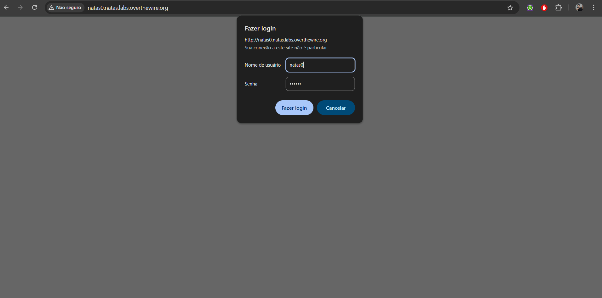

A página informa que a senha está escondida nela mesma, mas não há nada visível na interface do usuário. A primeira ação em qualquer teste de segurança web é verificar como a página foi construída.

Para isso, inspecionei o código-fonte da página (botão direito -\> Ver código-fonte ou `Ctrl+U`).

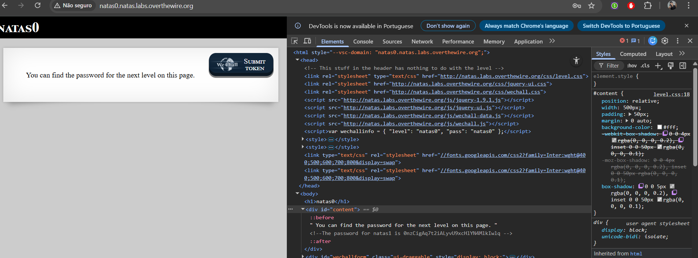

A senha foi encontrada dentro de um comentário HTML.

### Vulnerabilidade

A falha aqui é a exposição de informações sensíveis no lado do cliente (Client-Side). Comentários no código HTML (\`\`) não são renderizados pelo navegador visualmente, mas são baixados para a máquina do usuário. Desenvolvedores frequentemente usam comentários para notas internas e esquecem de removê-los em produção.

### Pesquisa

Pesquisei sobre **"HTML Comments sensitive data"** e como inspecionar elementos no navegador (DevTools).

-----

# Natas Level 1

### Objetivo

Acessar a senha para o nível 2. A página é idêntica à anterior, mas com uma restrição de interface.

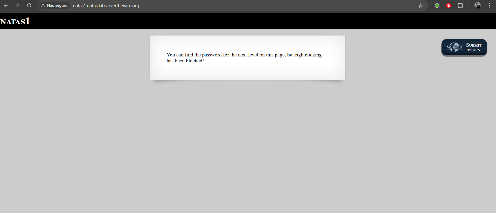
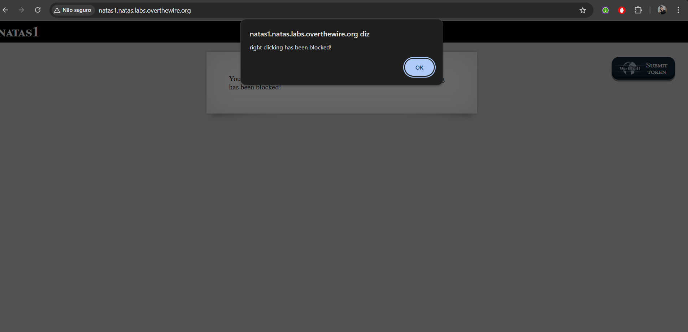
### Solução

Ao tentar clicar com o botão direito para ver o código-fonte, um alerta JavaScript bloqueia a ação.

No entanto, o bloqueio do botão direito é apenas um evento de interface (UI). O navegador ainda possui o código HTML carregado. Para contornar isso, utilizei o atalho de teclado `Ctrl + U` (ou digitei `view-source:` antes da URL).

Ao acessar o código-fonte, a senha estava novamente em um comentário.

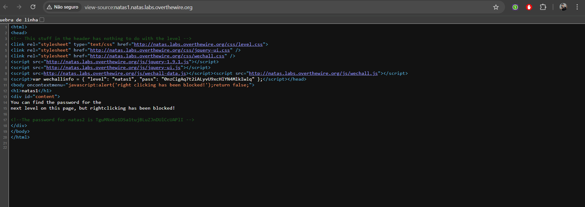
### Vulnerabilidade

A "segurança" implementada aqui depende exclusivamente de restrições no navegador (JavaScript). Como o código roda no computador do cliente, o usuário tem controle total sobre ele. Bloquear o botão direito ou desabilitar teclas não impede que o usuário veja o código que já foi enviado pelo servidor.

### Pesquisa

Pesquisei sobre **"Bypass right click disable JavaScript"** e **"View source shortcut chrome"**.

-----

# Natas Level 2

### Objetivo

Acessar a senha para o nível 3. A página informa que não há nada nela.

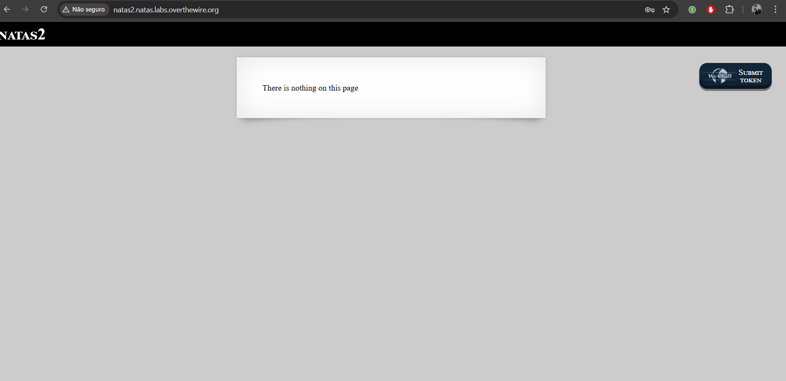
### Solução

Acessando a página, não há links visíveis ou texto contendo a senha.

Ao inspecionar o código-fonte, notei que havia uma tag de imagem ``. Mesmo que a imagem seja um pixel quase invisível, ela indica a existência de um diretório chamado `/files/`.

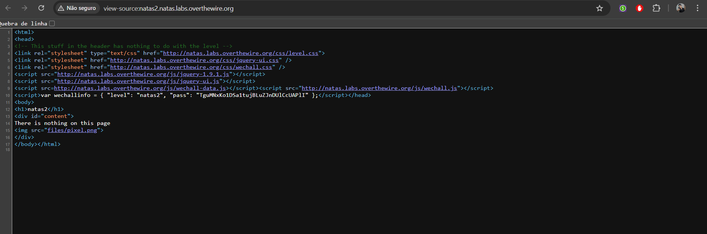

A URL da imagem confirma o caminho relativo:


Ao tentar acessar o diretório raiz onde a imagem está hospedada (`/files/`), o servidor retornou uma lista de todos os arquivos presentes naquela pasta.

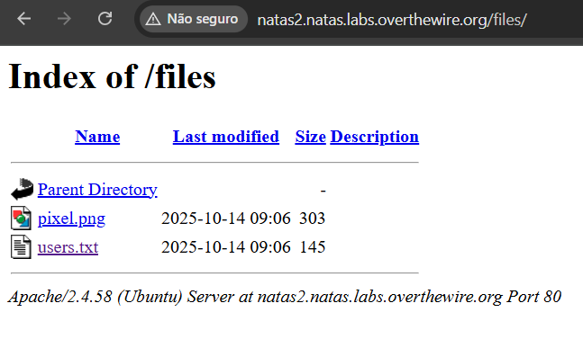

Encontrei um arquivo chamado `users.txt`. Ao abri-lo, a lista de usuários e senhas foi revelada.

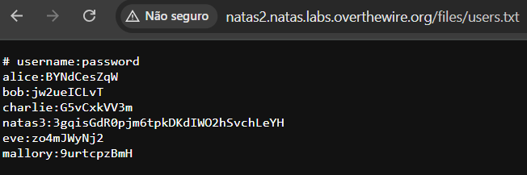
### Raciocínio

A vulnerabilidade explorada é conhecida como **Directory Listing** (Listagem de Diretório). Quando um servidor web não encontra um arquivo de índice padrão (como `index.html` ou `index.php`) em uma pasta e a listagem de diretórios não está desativada na configuração, ele mostra todos os arquivos contidos ali. Isso permite que atacantes descubram arquivos que não deveriam ser públicos.

### Pesquisa

Pesquisei sobre **"Apache Directory Listing vulnerability"** e **"Security by obscurity hidden files"**.

-----

# Natas Level 3

### Objetivo

Acessar a senha para o nível 4. A página inicial apresenta apenas a mensagem "There is nothing on this page" (Não há nada nesta página).

### Solução

Ao acessar o site, o conteúdo visível é inexistente.

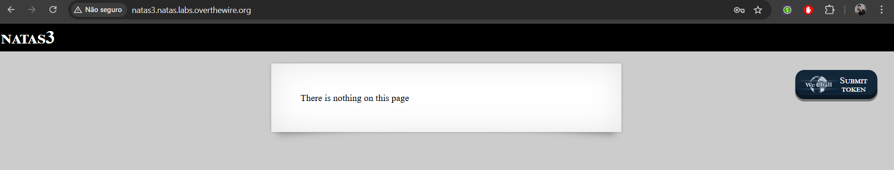

Seguindo a metodologia padrão, inspecionei o código-fonte da página. Encontrei um comentário intrigante: "No more information leaks\!\! Not even Google will find it this time..." (Sem mais vazamentos de informação\!\! Nem mesmo o Google vai encontrar desta vez...).

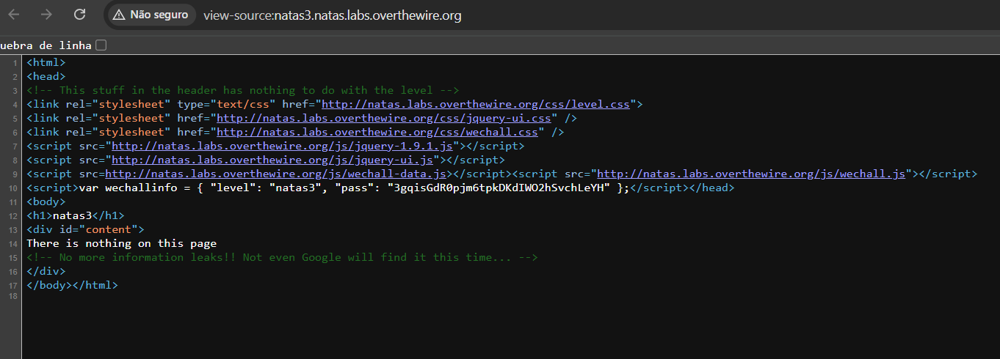

A menção ao Google refere-se a mecanismos de busca (crawlers). A forma padrão de instruir robôs de busca a não indexarem ou não acessarem certas partes de um site é através do arquivo `robots.txt`.

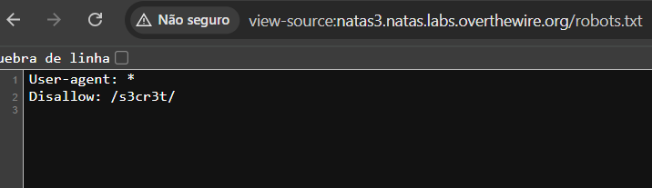

Acessei `http://natas3.natas.labs.overthewire.org/robots.txt` e encontrei uma regra de "Disallow" (Não permitir) para o diretório `/s3cr3t/`.

Ao navegar para esse diretório proibido (`/s3cr3t/`), o servidor listou os arquivos contidos nele, revelando o arquivo `users.txt`.

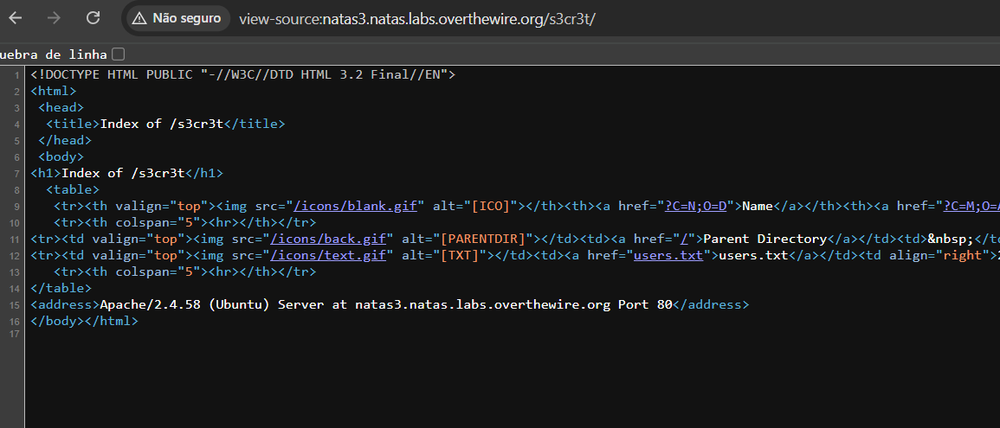

Abrindo o arquivo, obtive a credencial para o próximo nível.

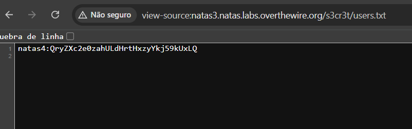
### Vulnerabilidade

A vulnerabilidade aqui é a **Security by Obscurity** (Segurança por Obscuridade) e o vazamento de informações via **robots.txt**. O arquivo `robots.txt` é público. Atacantes frequentemente verificam esse arquivo para descobrir quais diretórios os administradores consideram sensíveis ou privados.

### Pesquisa

Pesquisei sobre **"robots.txt security risk"** e **"web crawler directives"**.

-----

# Natas Level 4

### Objetivo

Acessar a senha para o nível 5. O acesso é negado com base na origem da visita.

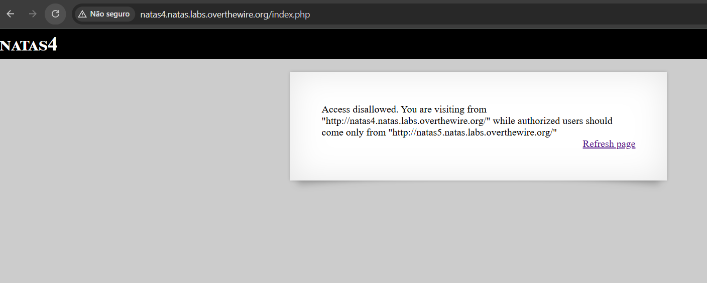
### Solução

Ao acessar a página, recebi uma mensagem de erro informando que o acesso é proibido porque estou visitando a partir do endereço atual (`natas4...`), enquanto usuários autorizados devem vir exclusivamente de `http://natas5.natas.labs.overthewire.org/`.

Isso indica uma verificação baseada no cabeçalho HTTP `Referer`. Para manipular essa requisição, utilizei a ferramenta **Burp Suite**. Configurei o proxy para interceptar o tráfego.

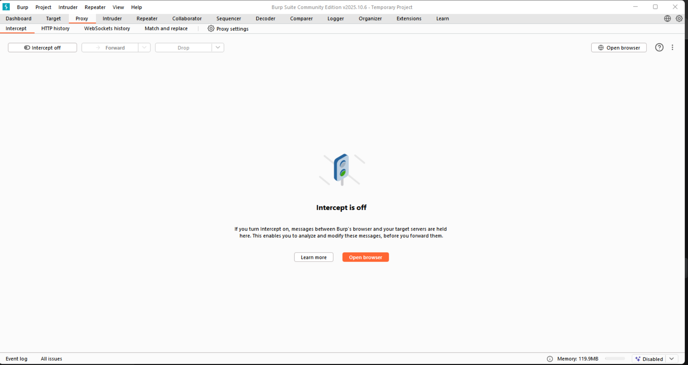

Enviei a requisição para o módulo "Repeater" do Burp Suite e alterei manualmente o cabeçalho `Referer` para o valor exigido pelo desafio: `http://natas5.natas.labs.overthewire.org/`.

Ao reenviar a requisição modificada, o servidor validou a origem falsa e retornou a página contendo a senha.

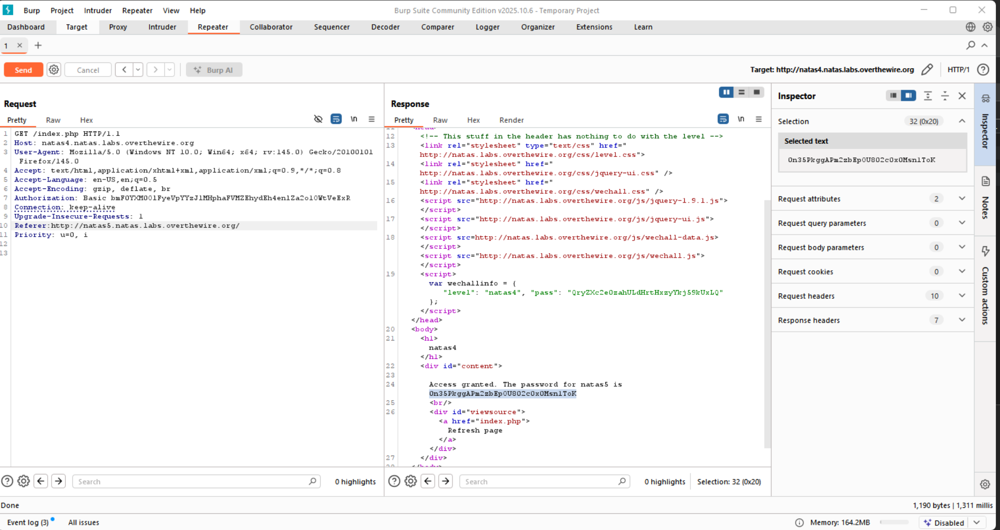

### Raciocínio (Vulnerabilidade)

A vulnerabilidade é a **Insecure Referer Checking** (Verificação Insegura de Referer). O cabeçalho `Referer` é enviado pelo navegador do cliente e pode ser facilmente modificado ou falsificado. Servidores nunca devem confiar nesse cabeçalho para autenticação ou controle de acesso.

### Pesquisa

Pesquisei sobre **"HTTP Referer header spoofing"**, **"Burp Suite Repeater tutorial"** e **"Modifying HTTP headers"**.

-----

# Natas Level 5

### Objetivo

Acessar a senha para o nível 6. O site informa que o usuário não está logado.

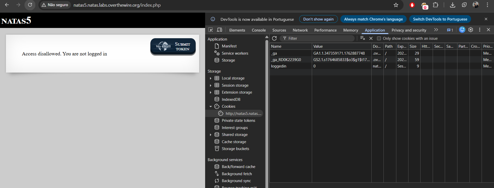
### Solução

A página exibe a mensagem "Access disallowed. You are not logged in" (Acesso negado. Você não está logado).

Abri as ferramentas de desenvolvedor (F12) e naveguei até a aba **Application** (ou Storage) para inspecionar os cookies armazenados pelo site.

Encontrei um cookie chamado `loggedin` com o valor `0`. Editei o valor do cookie `loggedin` de `0` para `1` diretamente no navegador e recarreguei a página. O servidor leu o novo valor do cookie, assumiu que eu estava autenticado e exibiu a senha.

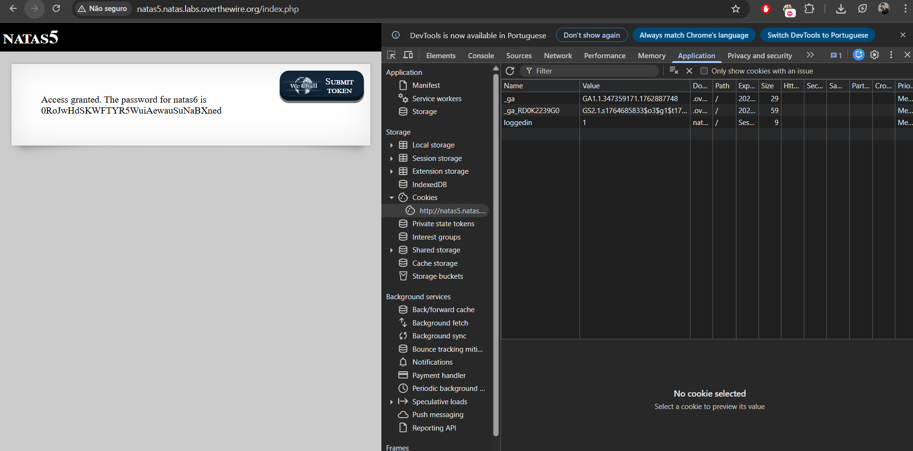

### Raciocínio

A falha é a **Insecure Client-Side Storage** e **Broken Authentication** (Autenticação Quebrada). O estado de autenticação foi confiado inteiramente a um dado armazenado no cliente (o cookie), sem validação criptográfica ou verificação no lado do servidor.

### Pesquisa

Pesquisei sobre **"Cookie manipulation attacks"**, **"Client-side authentication vulnerabilities"** e **"Editing cookies in DevTools"**.

-----

# Natas Level 6

### Objetivo

Acessar a senha para o nível 7. O site apresenta um formulário solicitando um segredo ("Input secret").

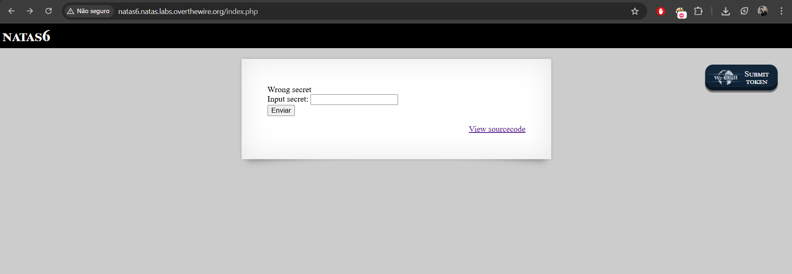

### Solução

Ao tentar submeter qualquer valor aleatório no formulário, o sistema retorna "Wrong secret".

Cliquei no link "View sourcecode" para analisar a lógica de validação no back-end.

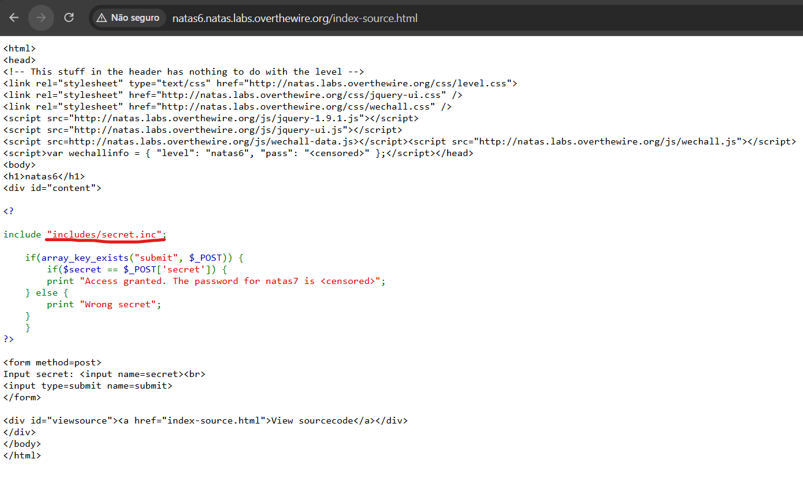

O código PHP revela que o segredo esperado é comparado com uma variável `$secret`, definida em um arquivo externo incluído: `include "includes/secret.inc";`. Tentei acessar o arquivo diretamente alterando a URL para `/includes/secret.inc`. Visualizei o código-fonte dessa página (`Ctrl+U`) para ler a variável.

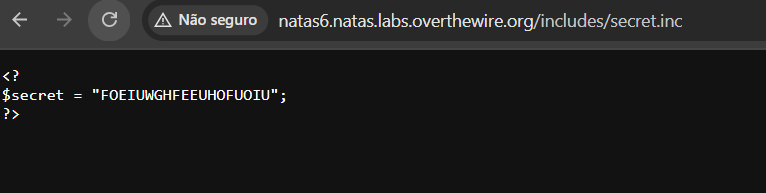

Copiei o segredo revelado (`FOEIUWGHFEEUHOFUOIU`), voltei à página inicial do nível e o submeti no formulário.


### Raciocínio

A falha aqui é a **Information Disclosure** (Divulgação de Informação) causada por má configuração de permissões de arquivo. Arquivos de configuração ou inclusão (como `.inc`) não devem estar acessíveis diretamente via URL.

### Pesquisa

Pesquisei sobre **"Preventing direct access to include files"** e **"Sensitive data exposure in source code"**.

-----

# Natas Level 7

### Objetivo

Acessar a senha para o nível 8. O site contém links para "Home" e "About" que mudam a URL via parâmetro `page`.

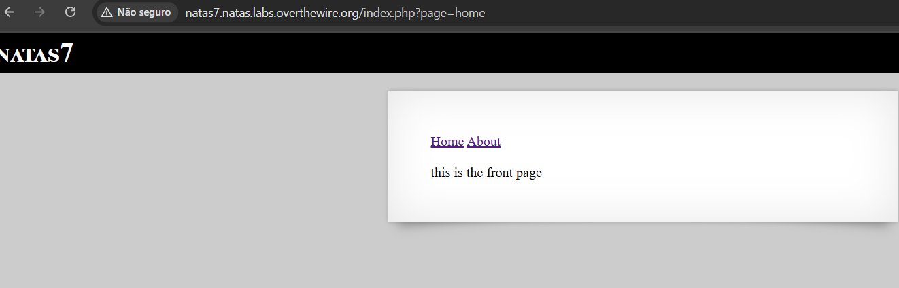
### Solução

Ao inspecionar o código-fonte, encontrei um comentário contendo o caminho absoluto da senha.

A dica informa: `password for webuser natas8 is in /etc/natas_webpass/natas8`.

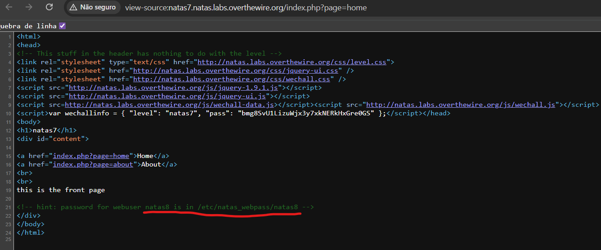

Testei a vulnerabilidade de Inclusão de Arquivo Local (LFI) inserindo o caminho absoluto fornecido na URL: `index.php?page=/etc/natas_webpass/natas8`.

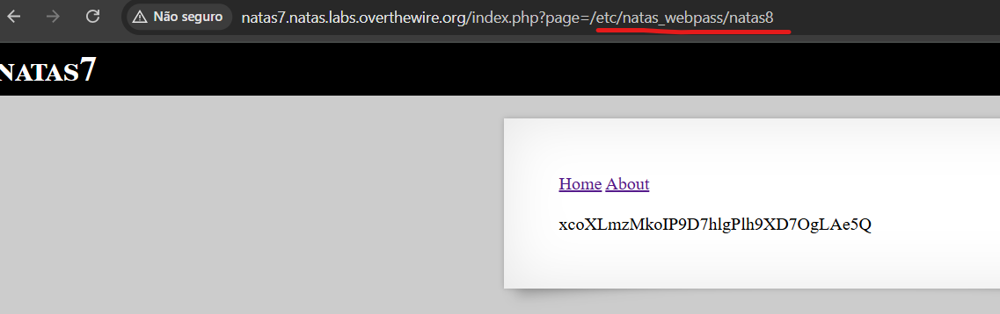

O servidor processou o caminho e exibiu o conteúdo do arquivo de senha diretamente na página.

### Vulnerabilidade

A vulnerabilidade explorada é **LFI (Local File Inclusion)**. Ela ocorre quando uma aplicação aceita entrada do usuário e a utiliza em funções de sistema de arquivos sem validação, permitindo a leitura de arquivos sensíveis do servidor.

### Pesquisa

Pesquisei sobre **"PHP Local File Inclusion LFI payloads"** e **"LFI /etc/passwd path traversal"**.

-----

# Natas Level 8

### Objetivo

Acessar a senha para o nível 9. O site solicita novamente um "secret".

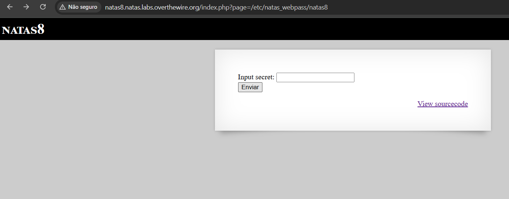
### Solução

A página inicial contém um formulário de entrada.

Ao analisar o código-fonte ("View sourcecode"), identifiquei a função `encodeSecret` que ofusca o segredo.

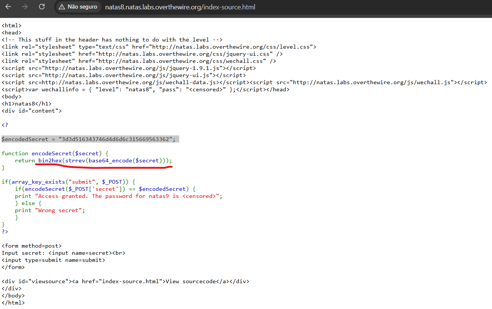

A lógica de encriptação é: `bin2hex(strrev(base64_encode($secret)))`.
Criei um script PHP simples para reverter a ordem das operações (`hex2bin` -\> `strrev` -\> `base64_decode`) usando a string hexadecimal fornecida no código.

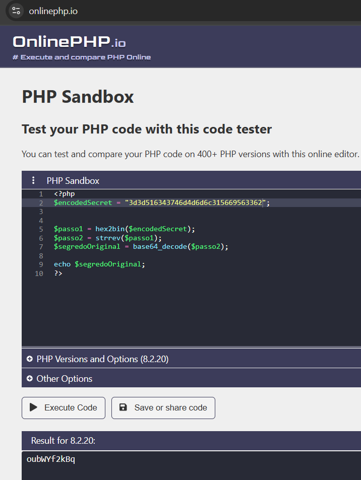

O script retornou o valor `oubWYf2kBq`. Submeti este valor no formulário do desafio e obtive acesso.

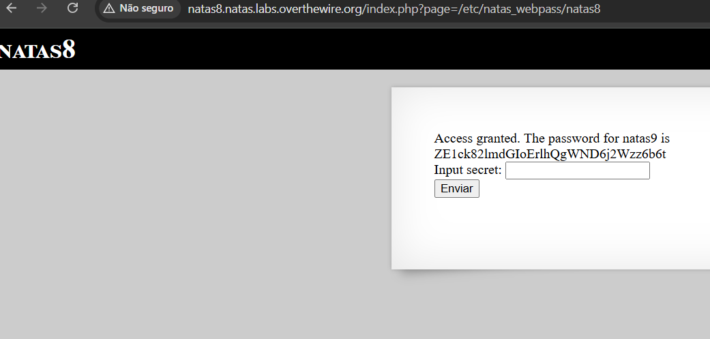
### Vulnerabilidade

A falha é o uso de **Encoding como Criptografia**. Codificação (Base64, Hex) apenas muda o formato dos dados e é facilmente reversível, não oferecendo proteção real aos dados.

### Pesquisa

Pesquisei sobre **"Difference between encoding and encryption"** e **"PHP reverse hex2bin base64"**.

-----

# Natas Level 9

### Objetivo

Acessar a senha para o nível 10. O site oferece uma ferramenta de busca em um dicionário.

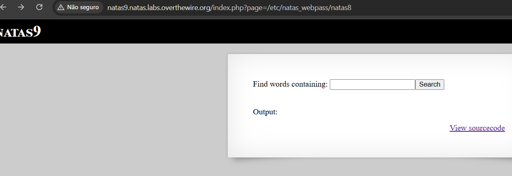
### Solução

A interface apresenta um campo de entrada "Find words containing".

O código-fonte mostra que a entrada é passada para `passthru("grep -i $key dictionary.txt");`.

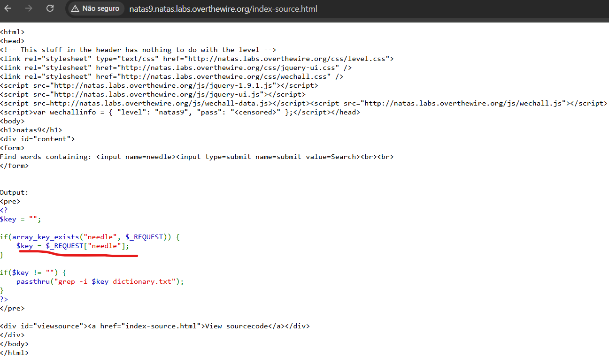

Utilizei o caractere `;` para separar comandos no Linux e injetei o comando `cat`.
Payload: `; cat /etc/natas_webpass/natas10`

Ao submeter a busca, o servidor executou o comando injetado e retornou a senha.

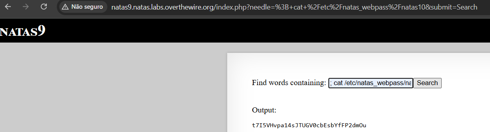

### Raciocínio (Vulnerabilidade)

A vulnerabilidade é **Command Injection** (Injeção de Comando). Ocorre quando o input do usuário é concatenado diretamente em comandos do sistema operacional sem sanitização.

### Pesquisa

Pesquisei sobre **"PHP passthru command injection"** e **"Linux shell command separators"**.

-----

# Natas Level 10

### Objetivo

Acessar a senha para o nível 11. O site filtra certos caracteres de comando.
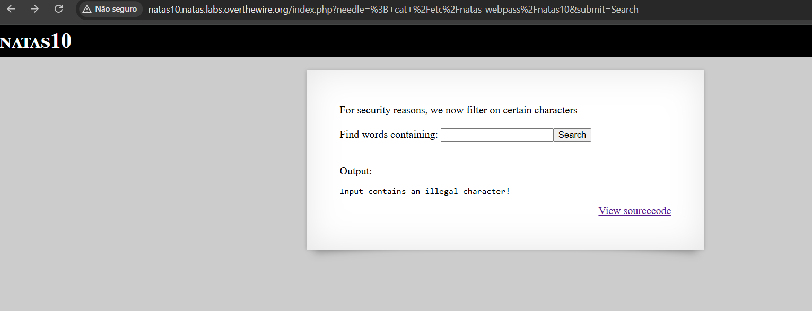

### Solução

A interface avisa que agora filtra certos caracteres por segurança.

O código-fonte mostra um filtro regex `/[;|&]/` que bloqueia `;`, `|` e `&`.

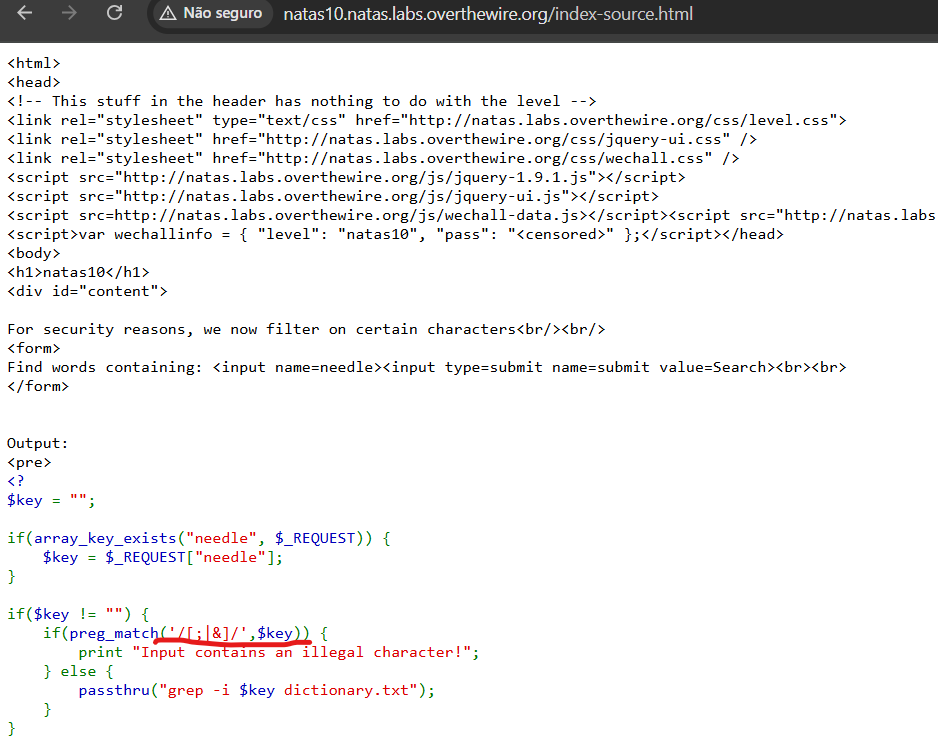

Como não podemos começar um novo comando, manipulamos os argumentos do `grep`. Forçamos o grep a ler o arquivo de senha passando-o como argumento extra.
Payload: `.* /etc/natas_webpass/natas11`

Isso fez com que o `grep` imprimisse todo o conteúdo do arquivo de senha.

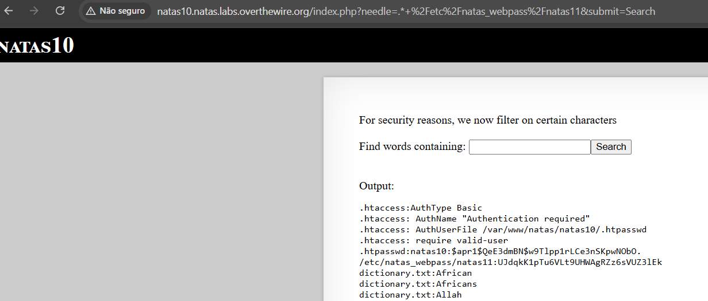
### Raciocínio

A vulnerabilidade é **Argument Injection** (Injeção de Argumento). Mesmo bloqueando separadores de comando, o controle sobre os argumentos de um programa pode permitir comportamentos não intencionais, como leitura de arquivos arbitrários.

### Pesquisa

Pesquisei sobre **"Grep argument injection"** e **"Bypassing command injection filters"**.

---

# Natas Level 11

### Objetivo

Acessar a senha para o nível 12. O site permite alterar a cor de fundo da página e informa que "Cookies are protected with XOR encryption" (Cookies são protegidos com encriptação XOR).

### Solução

Ao definir uma cor de fundo, o site salva um cookie chamado `data` contendo um valor codificado. Analisando o código-fonte ("View sourcecode"), identifiquei que o sistema utiliza uma criptografia XOR simples com uma chave fixa para proteger os dados do cookie.

A função `loadData` descriptografa o cookie e verifica o conteúdo de um array JSON:
`$defaultdata = array( "showpassword"=>"no", "bgcolor"=>"#ffffff");`

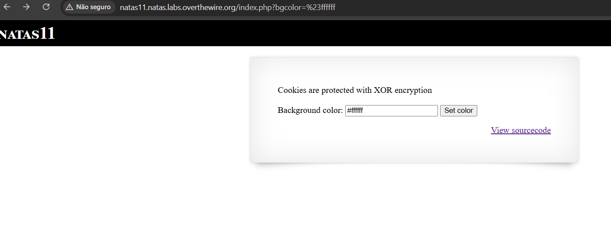

Para obter a senha, é necessário alterar o valor `showpassword` de `"no"` para `"yes"`.

Como a operação XOR é reversível (`A XOR B = C` implica `A XOR C = B`), utilizei um ataque de **Known Plaintext** (Texto Plano Conhecido). Eu possuía:

1.  **O Texto Plano:** O JSON padrão que vi no código (`{"showpassword":"no"...}`).
2.  **O Texto Cifrado:** O cookie gerado pelo site para esse padrão.

Criei um script PHP para fazer o XOR entre esses dois valores e descobrir a chave secreta utilizada pelo servidor.

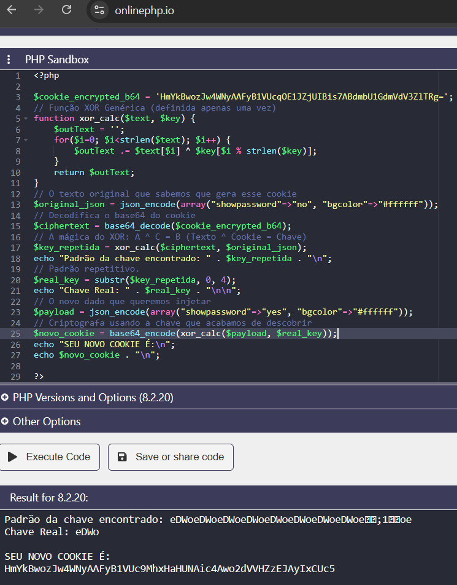

O script revelou que a chave de criptografia era `eDWo`.
Com a chave em mãos, o próprio script gerou um novo cookie malicioso contendo o JSON com `"showpassword"=>"yes"`.

Injetei este novo cookie no navegador (substituindo o valor original na aba Application \> Cookies), recarreguei a página e a senha foi revelada.

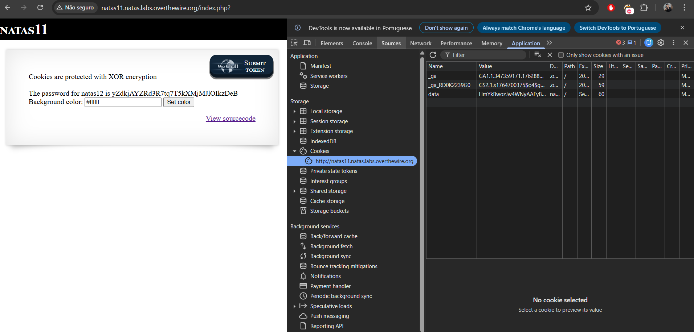

### Raciocínio (Vulnerabilidade)

A vulnerabilidade é o uso inseguro de criptografia (Weak Cryptography). O algoritmo XOR é rápido, mas não oferece confidencialidade se a chave for reutilizada e o atacante tiver acesso a uma amostra do texto original e do texto cifrado. Além disso, a chave estava "hardcoded" no servidor, mas pôde ser deduzida matematicamente sem acesso ao código-fonte, apenas pela análise dos dados de saída.

### Pesquisa

Pesquisei sobre **"XOR Cipher Known Plaintext Attack"** e **"PHP json\_encode vulnerability"**.

-----

# Natas Level 12

### Objetivo

Acessar a senha para o nível 13. O site permite o upload de arquivos JPEG com tamanho máximo de 1KB.

### Solução

Ao acessar o nível, encontrei um formulário de upload de arquivos.

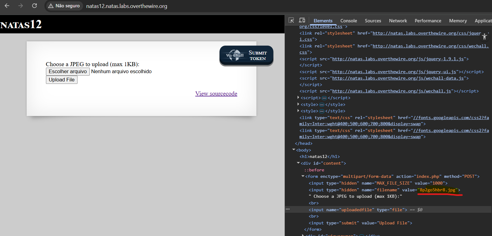

Analisando o código-fonte ("View sourcecode"), notei uma falha crítica na lógica de como o arquivo é salvo. O servidor gera um caminho aleatório, mas concatena a **extensão original** enviada pelo formulário.

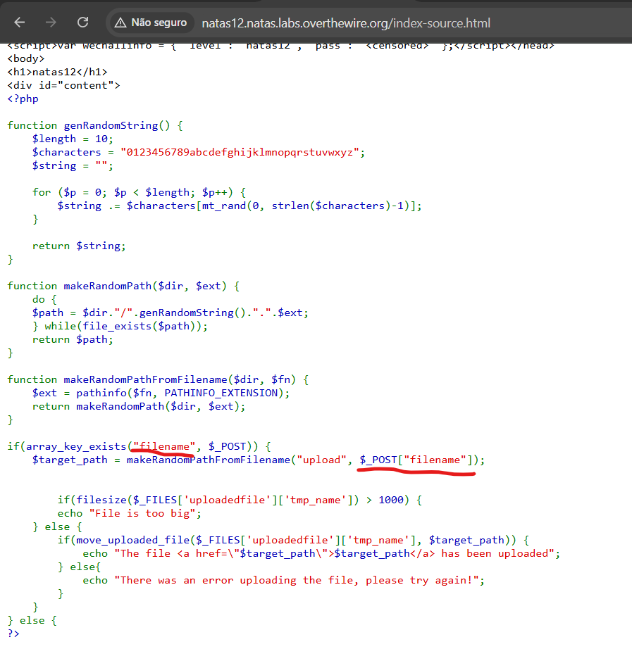

A linha `$target_path = makeRandomPathFromFilename("upload", $_POST["filename"]);` usa o parâmetro `filename` vindo do POST para definir a extensão final. Se eu conseguir enviar um arquivo `.php`, o servidor irá executá-lo.

**1. Criação do Payload**
Criei um script simples chamado `bypass.php` que utiliza a função `passthru` para executar o comando de leitura da senha.

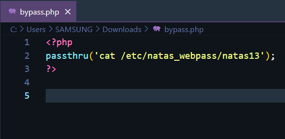

**2. Exploração (Manipulação de Input Oculto)**
Ao inspecionar o formulário com o DevTools (F12), percebi que o nome do arquivo é enviado em um campo oculto (`input type="hidden" name="filename"`).

Em vez de usar um proxy, manipulei o valor diretamente no navegador:

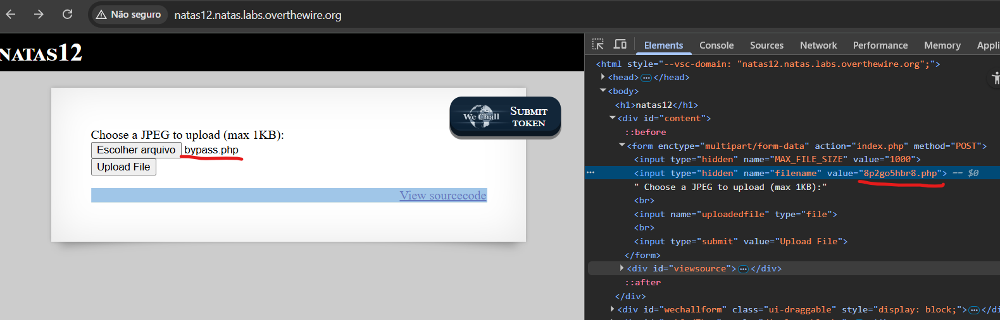

1.  Selecionei o arquivo `bypass.php` no formulário.
2.  No DevTools, localizei o `input name="filename"`.
3.  Alterei o valor gerado (que poderia estar como `.jpg`) para garantir que terminasse em `.php` (ex: `8p2go5hbr8.php`).

**3. Execução**
Após clicar em "Upload File", o servidor aceitou o arquivo e mostrou onde ele foi salvo.

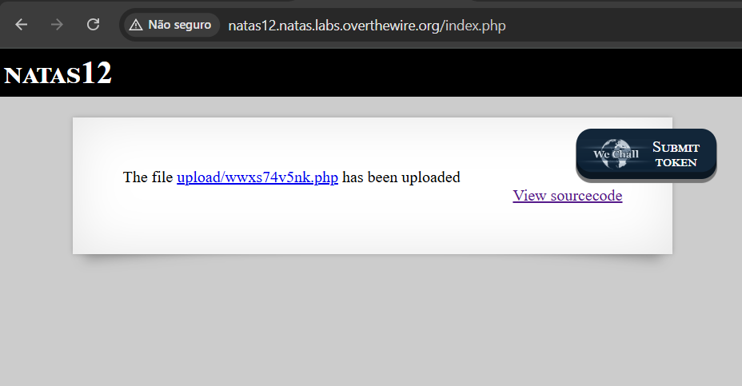

Cliquei no link fornecido pelo site. Como o arquivo tem a extensão `.php`, o servidor executou meu código `passthru` e exibiu o conteúdo do arquivo de senha.

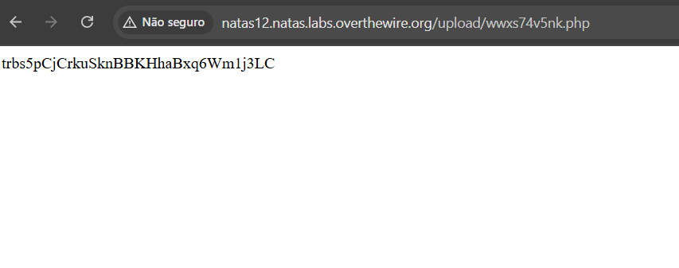

### Vulnerabilidade

A vulnerabilidade é **Unrestricted File Upload** combinada com confiança em dados do cliente. O servidor confia no campo `filename` enviado pelo formulário HTML para determinar a extensão do arquivo no disco. Como o HTML pode ser modificado pelo usuário (como mostrado no print), é trivial forçar o salvamento de um arquivo malicioso (`.php`) e obter Execução Remota de Código (RCE).

### Pesquisa

Pesquisei sobre **"Bypassing file upload extension check"** e **"Modifying hidden input fields DevTools"**.

-----

# Natas Level 13

### Objetivo

Acessar a senha para o nível 14. Este nível é similar ao anterior, mas adiciona uma verificação de segurança: "For security reasons, we now only accept image files\!".

### Solução

O servidor agora verifica se o arquivo é realmente uma imagem. Geralmente, essa verificação é feita lendo os "Magic Bytes" (os primeiros bytes do arquivo que identificam o formato). Para arquivos GIF, o cabeçalho é `GIF89a`.

**1. Criação do Payload (Bypass de Magic Bytes)**
Modifiquei meu script PHP para enganar o servidor. Adicionei a string `GIF89a` no início do arquivo, seguida pelo código PHP malicioso.

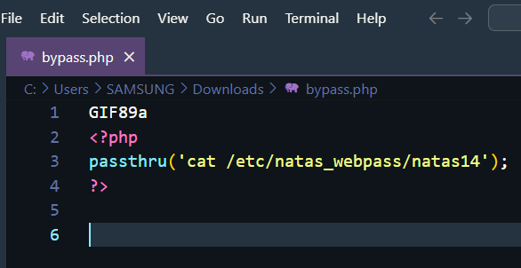

**2. Execução**
Fiz o upload do arquivo (garantindo novamente que a extensão fosse `.php`, usando a mesma técnica do nível 12 de modificar o input oculto ou interceptar, se necessário). O servidor aceitou o arquivo, acreditando ser uma imagem GIF válida.


Ao acessar o link do arquivo "imagem", o interpretador PHP ignorou o cabeçalho `GIF89a` (tratando-o como texto/HTML) e executou o bloco de código `<?php ... ?>` logo em seguida, revelando a senha.


### Raciocínio (Vulnerabilidade)

A vulnerabilidade é o **Bypass de Verificação de Conteúdo**. Validar um arquivo apenas pelos seus "Magic Bytes" (cabeçalho) não impede que ele contenha código malicioso executável. O servidor aceitou o arquivo como imagem, mas o salvou com extensão `.php` (ou a configuração do servidor permitiu execução), levando ao RCE.

### Pesquisa

Pesquisei sobre **"Magic bytes file upload bypass"** e **"PHP shell inside GIF image"**.

-----

# Natas Level 14

### Objetivo

Acessar a senha para o nível 15. O site apresenta uma página de login clássica solicitando "Username" e "Password".

### Solução

Ao acessar o nível, deparei-me com um formulário de autenticação padrão. Tentei credenciais comuns (admin/admin), mas sem sucesso.

Cliquei em "View sourcecode" para entender como a validação de login era feita no back-end. A vulnerabilidade ficou evidente na construção da consulta ao banco de dados (Query SQL).

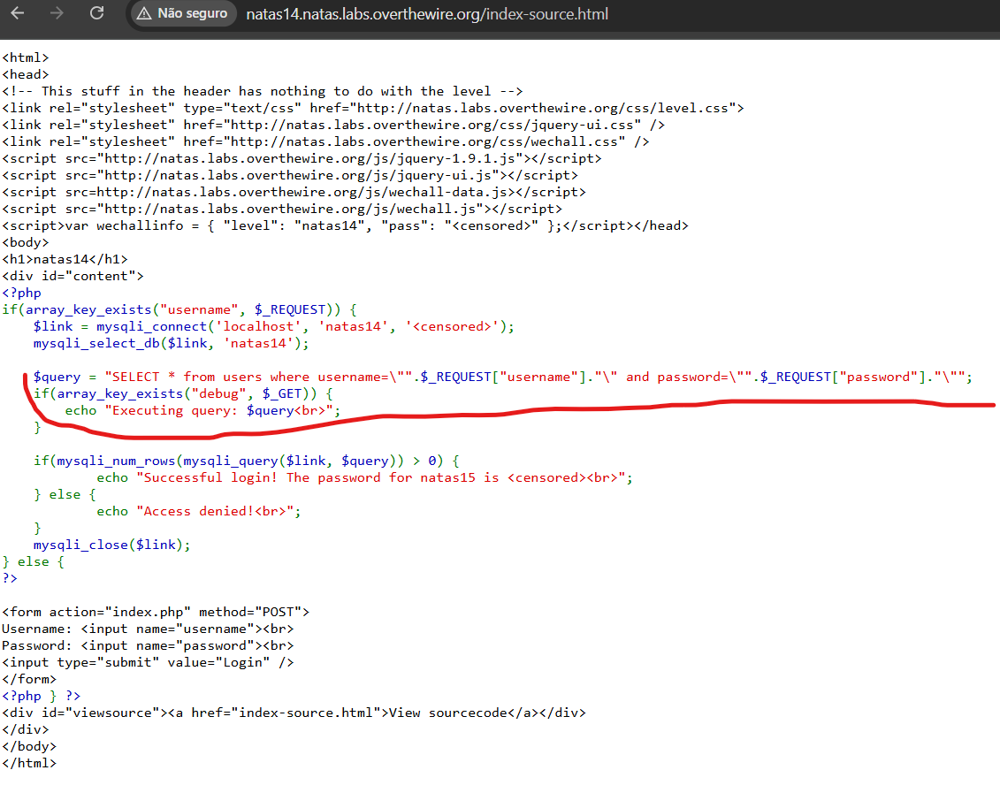

O código vulnerável é:

```php
$query = "SELECT * from users where username=\"".$_REQUEST["username"]."\" and password=\"".$_REQUEST["password"]."\"";
```

O PHP concatena diretamente o que o usuário digita dentro da string SQL, sem qualquer sanitização ou uso de Prepared Statements. Isso permite a **Injeção de SQL (SQL Injection)**.

**A Lógica do Ataque:**
A query original espera algo como:
`SELECT * FROM users WHERE username="usuario" AND password="senha"`

Meu objetivo é manipular a lógica para que a condição `WHERE` seja sempre **verdadeira**, independentemente da senha.

**O Payload:**
Utilizei o seguinte payload no campo de Username:
`" OR 1=1 #`

  * `"`: Fecha a aspa dupla que o código abriu para o nome de usuário.
  * `OR 1=1`: Adiciona uma condição lógica que é sempre verdadeira (1 é sempre igual a 1).
  * `#`: É o caractere de comentário em SQL. Isso faz com que o banco de dados ignore todo o resto da query (incluindo a verificação de senha e a aspa final).

A query final interpretada pelo banco ficou assim:
`SELECT * FROM users WHERE username="" OR 1=1 # AND password="..."`

Como `1=1` é verdadeiro, o banco de dados retorna o primeiro registro da tabela (geralmente o administrador) e o login é aprovado.

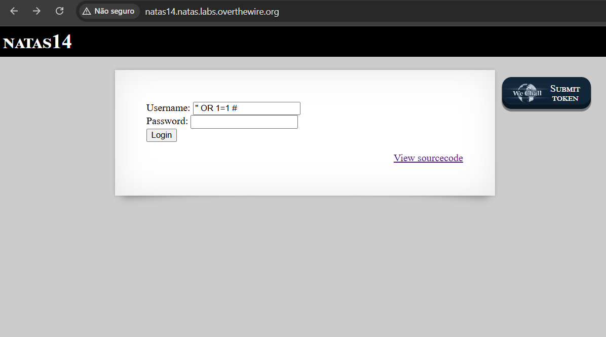

**Execução:**
Coloquei o payload no campo "Username" e deixei o campo "Password" em branco (pois ele seria comentado de qualquer forma).

Ao clicar em "Login", o site confirmou a autenticação e exibiu a senha do próximo nível.

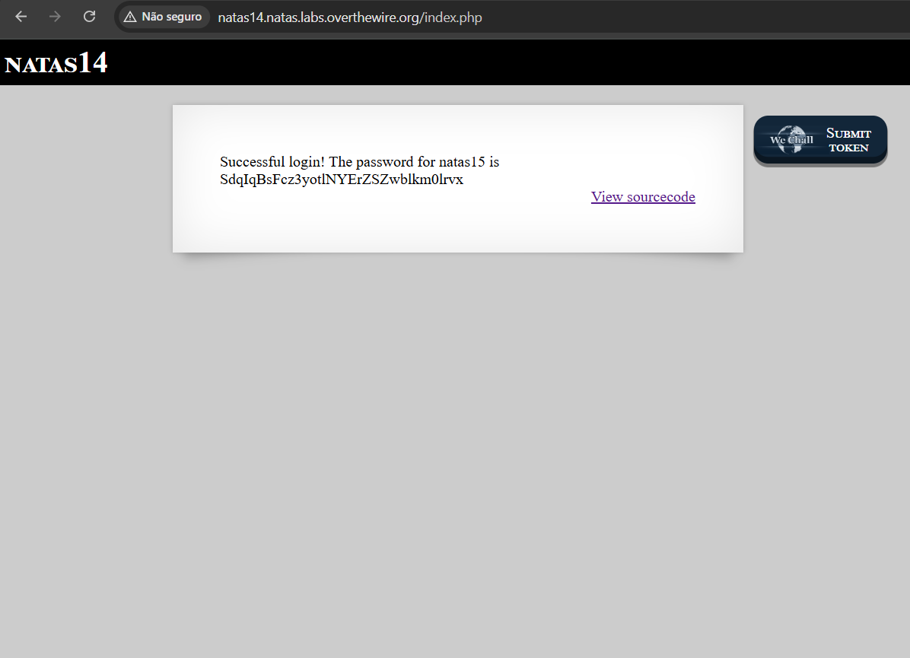

### Vulnerabilidade

A vulnerabilidade é **SQL Injection (SQLi)** Clássica. Ela ocorre quando dados fornecidos pelo usuário interferem na estrutura da consulta SQL. O desenvolvedor usou concatenação de strings em vez de **Prepared Statements** (Declarações Preparadas), que é a forma correta de prevenir esse ataque separando o código SQL dos dados.

### Pesquisa

Pesquisei sobre **"SQL Injection authentication bypass payload"** e **"SQL comment syntax MySQL"**.

-----

# Natas Level 15

### Objetivo

Acessar a senha para o nível 16. O site apresenta uma ferramenta para verificar a existência de um nome de usuário ("Check for username").

### Solução

Ao analisar o código-fonte ("View sourcecode"), percebi que a vulnerabilidade de SQL Injection ainda existe, mas o comportamento da aplicação mudou em relação ao nível anterior.

A query executada é: `SELECT * from users where username="INPUT"`.
No entanto, diferentemente do Natas 14, o código **não imprime** o resultado da consulta (não mostra a senha). Ele apenas verifica `mysql_num_rows > 0` e retorna uma mensagem booleana:

  * "This user exists." (Verdadeiro)
  * "This user doesn't exist." (Falso)

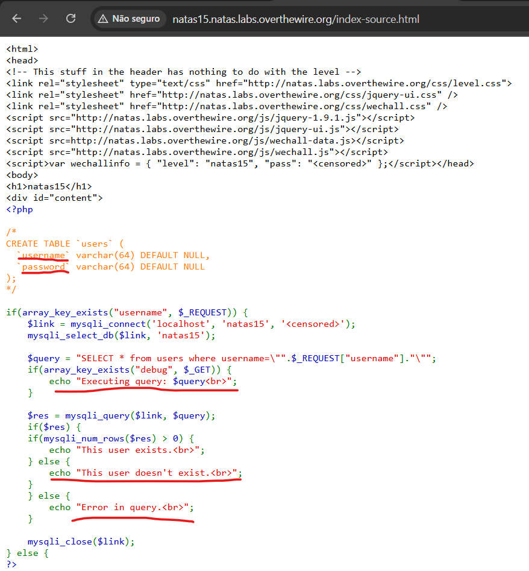

Isso caracteriza uma **Blind SQL Injection (Baseada em Booleanos)**. Não podemos ler os dados diretamente, mas podemos fazer perguntas de "Sim ou Não" para o banco de dados.

Sabemos que o usuário alvo é `natas16`. Precisamos adivinhar a senha caractere por caractere.
A pergunta SQL que faremos será:
*"O usuário é natas16 E a senha começa com a letra 'a'?"*
Payload teórico: `natas16" AND password LIKE BINARY "a%" #`

Se o site responder "This user exists", a primeira letra é 'a'. Se responder "doesn't exist", tentamos 'b', e assim por diante. O operador `BINARY` é crucial para distinguir maiúsculas de minúsculas.

**Automação em Python:**
Como a senha tem 32 caracteres e existem muitas possibilidades (letras maiúsculas, minúsculas e números), fazer isso manualmente é inviável. Desenvolvi um script em Python utilizando a biblioteca `requests` para automatizar o processo.

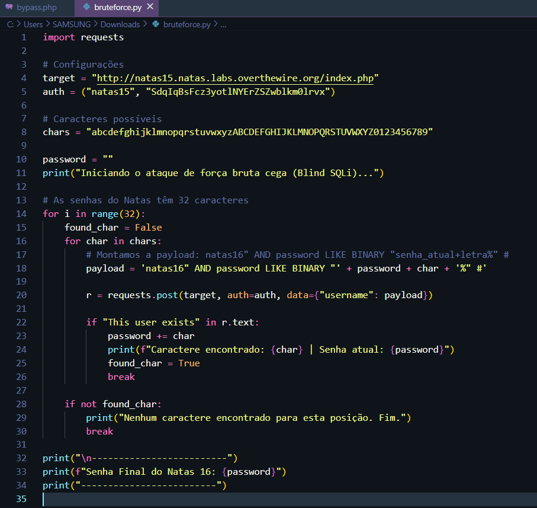

O script itera por 32 posições. Para cada posição, ele testa todos os caracteres possíveis (`a-z, A-Z, 0-9`). Se a resposta do servidor contiver "This user exists", o script registra o caractere encontrado e passa para o próximo.

**Execução:**

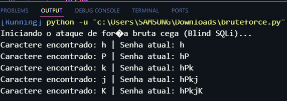

Ao rodar o script, ele começou a encontrar a senha letra por letra, confirmando a injeção bem-sucedida.

Após alguns minutos, o script finalizou a execução e apresentou a senha completa.

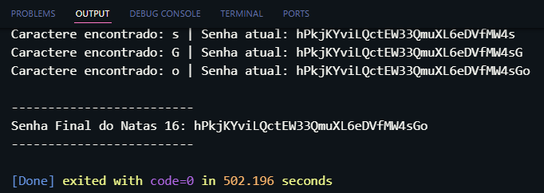

### Raciocínio

A vulnerabilidade é **Blind SQL Injection (Boolean-based)**. Mesmo que a aplicação não exiba dados do banco de dados na tela (como mensagens de erro ou tabelas), ela "vaza" informações através de suas respostas condicionais (usuário existe ou não). Isso permite que um atacante reconstrua dados sensíveis bit a bit ou caractere a caractere, inferindo a informação baseada na reação da página.

### Pesquisa

Pesquisei sobre **"Blind SQL Injection tutorial"**, **"Python requests brute force SQLi"** e **"MySQL LIKE BINARY case sensitive"**.
